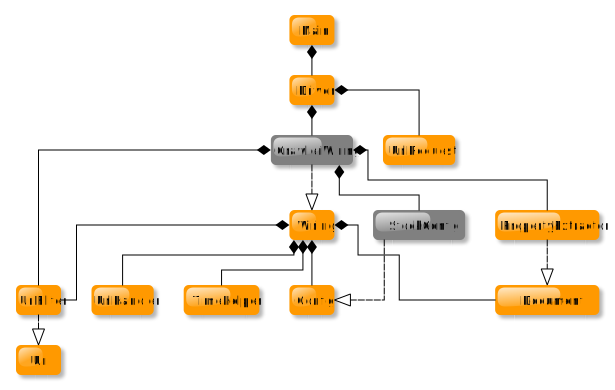

v 0.1
### Yosuga : Stock analyzer
---
Student: Rowan Pijnaker

### Inhoud
-  [Samenvatting](#samenvatting)
-  [Analyse process](#analyse-process)
-  [Ticker symbol](#ticker-symbol)
-  [Visueel](#visueel)
-  [KlassenDiagram](#klassendiagram)

---
### **Samenvatting**
Yosuga is een framework waarin jou geïnvesteerde aandelen geanalyseerd worden. Hierin word het analyseren van aandelen makkelijk en toegankelijk gemaakt. Door het gebruik van de middelen die paraat voor jou staan, om het gekozen aandeel te analyseren.

Hieruit kunnen zowel positieve als negatieve resultaten voortkomen. Door een investering in een aandeel aan te geven, wordt er gekeken naar je winstmarge en aanvullende informatie. Zoals het huidige rendement percentage. Op basis van koersdoelen berekend door gerenommeerde financiële instanties wordt het toekomstige verwachte rendement berekent. Dit zorgt ervoor dat jij met een beter toekomstzicht verder kan kijken en makkelijk nieuwe keuzes kan maken. Hierdoor zal je betere beslissingen kunnen maken waarin of hoe je investeert. 

Voer jou gegevens in zoals de aankoopprijs en het aantal stuks aandelen. Op basis van het opgegeven ticker symbol (aandeel of onderneming) wordt de huidige koers geanalyseerd en opgehaald. Vervolgens wordt deze actuele koers vergeleken met de door jou ingevoerde gegevens van eerdere investeringen, daarvan kunnen winst- of verliesmarges worden berekend.

Ook hopen we jou toekomst aanzicht te veranderen van bepaalde aandelen(ondernemingen) door middel van het weergeven van het rendement percentage.

In het framework waarmee aandelen geanalyseerd kunnen worden op basis van deze informatie potentiële doelen en of winst marges berekenen op vorige investeringen.

---
### **Analyse process**
De analyse wordt uitgevoerd door informatie van een of meerdere websites te scrapen (automatisch informatie verzamelen). Dit gebeurt op basis van de opgegeven website en de bijbehorende bronnen hierop. Uit deze bronnen wordt vervolgens specifieke informatie gehaald, zoals de actuele koers (prijs van het aandeel).

---
### **Ticker symbol**
Elk aandeel heeft een unieke identificatiecode. Een ticker symbol bestaat uit letters, cijfers of een combinatie daarvan. Wereldwijd zijn er verschillende manieren om aandelen te identificeren. Zo is de ISIN (International Securities Identification Number) een universele code van 12 cijfers waarmee aandelen van elkaar kunnen worden onderscheiden.

---
### **Visueel**
Het framework wordt weergegeven in de vorm van broncode. Deze code is zichtbaar in de gebruikte IDE op PC.

---
### **KlassenDiagram**

